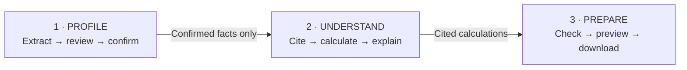
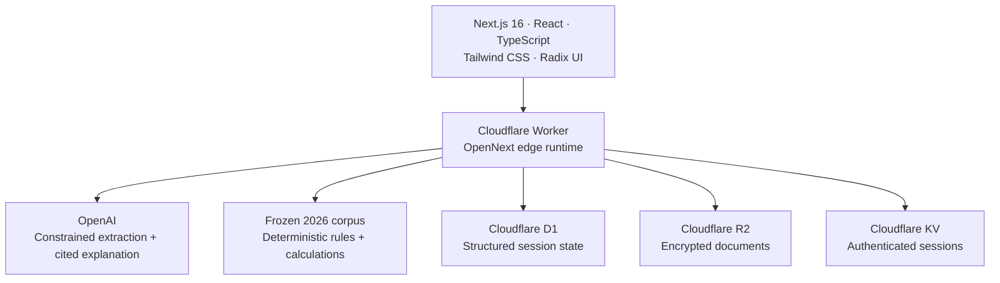

<div align="center">
  <h1>RealDoor</h1>
  <p><strong>Application-readiness copilot for affordable housing — Next.js 16 on Cloudflare Workers</strong></p>

  <p>
    <a href="https://nextjs.org/"></a>
    <a href="https://workers.cloudflare.com/"></a>
    <a href="https://www.typescriptlang.org/"></a>
    <a href="https://tailwindcss.com/"></a>
  </p>
</div>

<br />

## Application-readiness, without automated decisioning

RealDoor turns synthetic household documents into a renter-confirmed profile, explains a frozen affordable-housing rule set with citations, identifies missing or expired documents, and creates a packet the renter controls.

> **The AI extracts and explains. Deterministic code calculates. The renter confirms. A qualified human decides.**

## Technical walkthrough

### One evidence-linked journey



| Stage          | What happens                                                                                              | Trust boundary                                                                                                         |
| -------------- | --------------------------------------------------------------------------------------------------------- | ---------------------------------------------------------------------------------------------------------------------- |
| **Profile**    | PDFs and images are parsed; OpenAI proposes only allowlisted fields.                                      | Every value is schema-validated, evidence-linked, and held back until the renter confirms or corrects it.              |
| **Understand** | Questions are answered from a frozen 2026 LIHTC corpus with pinpoint citations.                           | Income math is deterministic and reproducible. The system never produces an eligibility verdict.                       |
| **Prepare**    | Confirmed evidence is checked against a versioned document checklist and assembled into a branded packet. | The renter chooses what to include, previews before download, and can delete the entire session. Nothing is auto-sent. |

### Architecture at a glance



| Layer                 | Implementation                                                                                                                    |
| --------------------- | --------------------------------------------------------------------------------------------------------------------------------- |
| **Product interface** | Next.js 16 App Router, React 19, TypeScript, Tailwind CSS v4, Radix UI, and accessible server-first components                    |
| **AI boundary**       | OpenAI Responses API, strict Zod schemas, field allowlists, source-quote validation, abstention, and prompt-injection detection   |
| **Rules engine**      | Versioned Boston–Cambridge–Quincy 2026 corpus, authoritative source passages, fixed effective dates, and deterministic arithmetic |
| **Data layer**        | Drizzle ORM on Cloudflare D1, AES-GCM encrypted payloads, R2 object storage, and KV-backed sessions                               |
| **Runtime**           | OpenNext on Cloudflare Workers with edge-native D1, R2, KV, static assets, and Durable Objects                                    |
| **Document system**   | `unpdf` for PDF reading and `pdf-lib` for selectable, branded RealDoor documents                                                  |

### Safety is implemented, not stated

- **Human confirmation:** AI-extracted values cannot influence calculations, answers, checklists, or packets until confirmed.
- **Deterministic math:** the model never calculates eligibility; code applies the frozen formula and exposes every input and intermediate value.
- **No decisioning:** requests for approval, denial, qualification, scoring, ranking, or acceptance prediction are refused.
- **Untrusted documents:** embedded document instructions cannot change the field allowlist, rules, tools, or access boundaries.
- **Privacy controls:** uploads and persisted session payloads are encrypted; logs exclude raw document contents; session deletion cascades through renter-held data.
- **Accessible workflow:** keyboard operation, visible focus, labeled status, structured headings, and text—not color alone—communicate state.

### Verification coverage

The automated suite covers extraction, evidence confirmation, deterministic contracts, authoritative corpus integrity, refusals, adversarial prompt injection, document policy, encryption, packet composition, and deletion behavior. Production builds are verified against the Cloudflare Worker runtime before release.

---

## Getting Started

### Prerequisites

Ensure you have the following installed on your machine:

- [Node.js](https://nodejs.org/en/) 22.x
- [pnpm](https://pnpm.io/) 10.x (via Corepack is recommended)
- Optional: `nvm` or another Node version manager if you want to consume the repo’s `.nvmrc` version hint automatically.
- Optional: a global [Wrangler CLI](https://developers.cloudflare.com/workers/wrangler/install-and-update/) install. The repo already pins `wrangler` in `devDependencies`, and the documented `pnpm` scripts use that version.

The repo includes `.nvmrc` and `package.json` `engines` to document the expected Node major as 22.

### 1. Clone & Install dependencies

```bash
git clone https://github.com/your-username/realdoor.git
cd realdoor
corepack enable
# Optional, if you use nvm:
nvm use
pnpm install
```

### 2. Environment Setup

Create `.env` from the shipped example for plain `pnpm dev` and repo-local tooling:

```bash
cp .env.example .env
```

If you plan to run `pnpm preview` or any direct Wrangler-backed local flow, also create `.dev.vars`:

```bash
cp .dev.vars.example .dev.vars
```

Use the files as follows:

- `.env` is the input for `pnpm dev` and basic repo-local tooling.
- `.dev.vars` is only needed for Cloudflare-backed preview/testing (`pnpm preview` and direct Wrangler flows).
- `wrangler.jsonc` `vars` are for committed, non-sensitive Worker values.
- Put preview/runtime secrets in `.dev.vars` locally and in Cloudflare Worker secrets when deployed, not in committed `vars`.
- If you run remote Cloudflare deploy or remote Wrangler tooling from your machine, export `CLOUDFLARE_ACCOUNT_ID`, `CLOUDFLARE_API_TOKEN`, and `DATABASE_ID` in your shell or load them with a tool such as `direnv`. The documented `pnpm` deploy/Wrangler commands do not automatically ingest `.env`.

For a basic local run, the baseline values are:

- `NEXT_PUBLIC_SITE_URL`
- `NEXT_PUBLIC_APP_URL`

Everything else in the examples is either a deploy credential or an optional integration. Leave it blank until you actually need that feature.

### Cloudflare Deploy & Remote Tooling

- `CLOUDFLARE_ACCOUNT_ID`, `CLOUDFLARE_API_TOKEN`, and `DATABASE_ID` for production Drizzle, remote D1 tooling, and deploy flows.
- Provide them in your shell environment for direct `pnpm deploy*`, `wrangler`, or other remote Cloudflare commands.

### Optional Integrations

Only add these when you enable the feature:

- `GOOGLE_CLIENT_ID` and `GOOGLE_CLIENT_SECRET` for Google SSO.
- `NEXT_PUBLIC_TURNSTILE_SITE_KEY` and `TURNSTILE_SECRET_KEY` for captcha-protected auth flows.
- `RESEND_API_KEY` for outbound transactional email.
- `EMAIL_FROM`, `EMAIL_FROM_NAME`, and `EMAIL_REPLY_TO` for sender identity.
- `OPENAI_API_KEY` and `PERPLEXITY_API_KEY` for AI features.

Optional diagnostics:

- `DB_SQL_LOG=true` to enable SQL query logging.

Deploy/release note: the default release path applies remote D1 migrations before code deploy. That assumes backward-compatible, additive schema changes. Breaking schema changes still need a two-phase rollout: deploy code that supports both shapes, migrate, then remove the old path in a later deploy.

### 3. Database Setup (Cloudflare D1)

The application uses Cloudflare D1 locally via Wrangler. The schema source of truth lives under `src/db/schema/`; `src/db/schema.ts` is only the compatibility barrel.

```bash
pnpm db:migrate:dev
```

Schema-change workflow:

1. Edit the relevant files under `src/db/schema/`.
2. Run `pnpm db:generate <name>`.
3. Review and commit the generated SQL migration plus the matching `src/db/migrations/meta/*` changes.
4. Run `pnpm db:migrate:dev` for local D1.
5. Remote D1 migrations are applied manually during release, not through a dedicated repo script.

### 4. Cloudflare Bindings (Types)

Generate TypeScript definitions for your Cloudflare environment variables and bindings:

```bash
pnpm cf-typegen
```

Run this after pulling or making `wrangler.jsonc` binding changes.

### 5. Start Local Development

For standard UI and App Router iteration, start the plain Next.js dev server:

```bash
pnpm dev
```

This runs `next dev -p 3000` and serves the app at [http://localhost:3000](http://localhost:3000).

For Cloudflare-backed local preview/testing, use:

```bash
pnpm preview
```

Use `pnpm preview` when you need the built Worker runtime and Cloudflare bindings locally, such as D1/KV/R2-dependent behavior, webhook handling, or other binding-dependent flows.

---

## Essential Commands

| Command                   | Description                                                                                                     |
| ------------------------- | --------------------------------------------------------------------------------------------------------------- |
| `pnpm dev`                | Starts the plain local Next.js development server (`next dev`).                                                 |
| `pnpm build`              | Builds the Next.js application.                                                                                 |
| `pnpm build:analyze`      | Builds the application and outputs a bundle analysis.                                                           |
| `pnpm db:generate [name]` | Generates a new Drizzle migration file based on schema changes.                                                 |
| `pnpm db:migrate:dev`     | Applies pending migrations to the local Cloudflare D1 database.                                                 |
| `pnpm cf-typegen`         | Generates TypeScript interfaces for Cloudflare bindings defined in `wrangler.jsonc`. Run after binding changes. |
| `pnpm email:dev`          | Starts the React Email preview server on port 3003.                                                             |
| `pnpm worker:build`       | Builds the generated Cloudflare Worker and applies the repo’s post-build worker patch step.                     |
| `pnpm worker:preview`     | Builds the Worker and runs the Cloudflare-backed local preview.                                                 |
| `pnpm worker:deploy`      | Code deploy only: builds and deploys the Worker without local/remote migration orchestration.                   |
| `pnpm preview`            | Compatibility alias for `pnpm worker:preview`.                                                                  |
| `pnpm deploy`             | Compatibility alias for `pnpm worker:deploy`.                                                                   |
| `pnpm deploy:dry-run`     | Dry-run deploy: builds the Worker and produces a deployable bundle without publishing.                          |
| `pnpm build:prod`         | Compatibility alias for `pnpm deploy:dry-run`.                                                                  |

---

## Architecture & Conventions

### Database & ORM

- We use **Drizzle ORM** with Cloudflare D1.
- **Important:** Cloudflare D1 currently does not support database transactions via Drizzle.
- IDs are auto-generated via CUID2 at the schema level. Never pass IDs manually when inserting records using `db.insert().values()`.

### Cloudflare Context

To access Cloudflare bindings (KV, D1, R2, Environment Variables) inside Next.js API routes or Server Components, use the provided context utility:

```typescript
import { getCloudflareContext } from "@opennextjs/cloudflare";

const { env, cf, ctx } = getCloudflareContext();
```

### Cloudflare Bindings

The deployed Worker expects the following bindings for full feature parity:

- `APP_D1` is the app-facing D1 binding inside application code. The checked-in Worker entry maps it to Wrangler's `NEXT_TAG_CACHE_D1` binding, which OpenNext still uses for tag-cache integration.
- `NEXT_INC_CACHE_KV` is the Next.js incremental cache KV binding.
- `NEXT_CACHE_DO_QUEUE` is the Durable Object queue binding used by OpenNext.
- `ASSETS` is the static asset binding for the Worker bundle.
- `WORKER_SELF_REFERENCE` is the internal service binding for the Worker itself.
- `APP_KV` is the app KV namespace used by session/cache-related features.
- `R2` is the document storage bucket binding.

These bindings are declared in `wrangler.jsonc`; run `pnpm cf-typegen` after config changes if you need updated generated types.

### Authentication

- **Server Components:** Retrieve the active session using `getSessionFromCookie()` from `src/utils/auth.ts`.
- **Client Components:** Retrieve the active session using `useSessionStore((state) => state.session)` from `src/state/session.ts`.

---

## Contributing

1. Create a new branch for your feature (`git checkout -b feature/amazing-feature`)
2. Commit your changes (`git commit -m 'Add amazing feature'`)
3. Push to the branch (`git push origin feature/amazing-feature`)
4. Open a Pull Request

**Coding Guidelines:**

- Prefer React Server Components (RSC) to reduce client JavaScript.
- Limit the use of `'use client'`, `useEffect`, and `useState`.
- Format code via Prettier/ESLint rules before committing.
- Do not add packages arbitrarily; use `pnpm` and check `package.json` for existing libraries first.

---

## License

This project is licensed under the MIT License.
